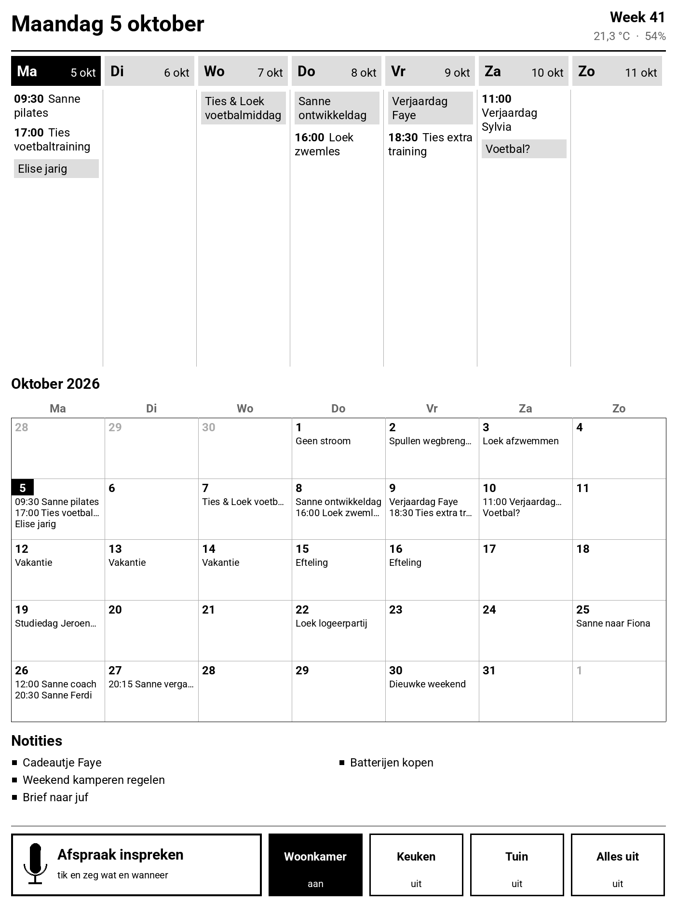

# Ink – gezinskalender op de reTerminal E1003

Vervangt het whiteboard op de koelkast door een Seeed reTerminal E1003
(10,3" e-paper, staand opgehangen), gekoppeld aan Home Assistant:

- **Week en maand**: bovenaan de week, daaronder de maand, net als op het whiteboard.
- **Notities**: open taken uit een HA-takenlijst.
- **Knoppen**: vier knoppen om lampen, scripts en dergelijke in HA aan of uit te zetten.
- **Afspraak inspreken**: tik op de knop en zeg bijvoorbeeld "zaterdag half drie
  verjaardag oma". Het scherm laat zien wat het begrepen heeft; pas na
  **Opslaan** komt de afspraak in de kalender.



| Inspreken | Voorstel | Melding |
|---|---|---|
|  |  |  |

*De previews worden gemaakt door de echte tekencode (`esphome/ink_kalender.h`),
zie [Preview en tests](#preview-en-tests).*

## Zo werkt het

```
 Local Calendar ─┐                         ┌─► week / maand / notities
 To-do-lijst ────┼─► blueprint (HA) ──────►│      (ESPHome-actie toon_agenda)
                 │         ▲               │
                 │         │ esphome.ink_spraak (tekst)
                 │   AI-taak: tekst ─► titel/datum/tijd ─► toon_voorstel
                 │         │
                 └─◄ calendar.create_event ◄── esphome.ink_opslaan (na "Opslaan")
```

- De spraakherkenning loopt via de normale **Assist-pijplijn** van HA (Whisper of HA Cloud).
- Een **AI-taak** (`ai_task.generate_data`) maakt van de zin een afspraak. Begrippen
  als "volgende week dinsdag" en "half drie" worden zo goed opgepakt.
- Het scherm ververst alleen als er iets verandert. Een volledige verversing
  (grijstinten, knippert ~1 s) volgt bij nieuwe agenda-data en om middernacht. Knoppen
  en pop-ups gebruiken de snelle DU-modus.

## Bestanden

| Pad | Wat |
|---|---|
| `esphome/ink-kalender.yaml` | ESPHome-config voor het scherm |
| `esphome/ink_kalender.h` | Layout, kalenderlogica en touchvlakken (C++) |
| `esphome/secrets.example.yaml` | Voorbeeld voor `secrets.yaml` |
| `homeassistant/blueprints/ink_kalender.yaml` | Blueprint: agenda naar het scherm, spraak naar afspraak |
| `tools/preview/` | Tests en PNG-previews zonder hardware |

## Installatie

Nodig: Home Assistant met de **ESPHome Device Builder**-add-on (ESPHome **2026.7 of nieuwer**).

### 1. Home Assistant voorbereiden

1. **Kalender**: je hebt al een Local Calendar. Wil je per gezinslid de naam
   zien? Maak dan meerdere Local Calendars aan en zet in de blueprint
   "Kalendernaam voor de titel zetten" aan.
2. **Notities** (optioneel): Instellingen → Apparaten en diensten → *Local To-do*,
   bijvoorbeeld een lijst "Notities".
3. **AI-taak**: voeg een AI-integratie toe die AI-taken ondersteunt:
   - *Ollama* draait helemaal lokaal, maar vraagt een redelijke pc of server.
   - *OpenAI*, *Google Gemini* en *Anthropic* zijn cloud-diensten en kosten een paar cent per maand bij dit gebruik.

   Controleer onder de integratie dat er een `ai_task.…`-entiteit is.
4. **Spraakassistent**: Instellingen → Spraakassistenten → *Assistent toevoegen*:
   - Taal **Nederlands**.
   - Spraak-naar-tekst: **Whisper** (add-on, lokaal) of **Home Assistant Cloud**.
     Voor Nederlands lokaal minimaal het Whisper-model `small-int8`; op een Pi
     is dat traag (enkele seconden). HA Cloud is snel en goed in Nederlands.
   - Tekst-naar-spraak is niet nodig (het scherm heeft geen speaker).

### 2. Scherm flashen

1. Zet in de ESPHome Builder-add-on je secrets (wifi, API-sleutel, OTA-wachtwoord),
   zie `esphome/secrets.example.yaml`.
2. Zet `ink-kalender.yaml` en `ink_kalender.h` samen in `/config/esphome/`. Dat kan
   via de *File editor*- of *Studio Code Server*-add-on.
3. Pas bovenin `ink-kalender.yaml` de `substitutions` aan: de vier knoppen
   (`knopN_naam` en `knopN_entiteit`). Een lege naam verbergt de knop.
4. Installeer. De eerste keer moet dat via USB-C vanaf een computer (Chrome of Edge):
   *Install → Manual download*, daarna flashen via <https://web.esphome.io>.
   Daarna gaan updates draadloos.

### 3. Koppelen

1. HA ziet het nieuwe ESPHome-apparaat; voeg het toe.
2. Ga naar **ESPHome → Ink kalender → Configureren** en zet
   **"Allow the device to perform Home Assistant actions"** aan. Zonder deze
   instelling werken de knoppen en het inspreken niet.
3. Kies bij het apparaat onder *Configuratie → Assistent* de Nederlandse assistent uit stap 1.

### 4. Blueprint

- Is deze repo publiek? Ga dan naar Instellingen → Automatiseringen → Blueprints →
  *Blueprint importeren* en plak:
  `https://github.com/joenivl/Ink/blob/main/homeassistant/blueprints/ink_kalender.yaml`
- Is de repo privé? Kopieer het bestand dan naar
  `/config/blueprints/automation/ink/ink_kalender.yaml` en herlaad de automatiseringen.

Maak daarna een automatisering van de blueprint. Je kiest daarin de kalenders,
de kalender voor nieuwe afspraken, eventuele takenlijsten en de AI-taak.

## Bediening

| | |
|---|---|
| **Afspraak inspreken** (of de groene knop) | Tik, spreek, wacht. Tik nog een keer om te stoppen. |
| **Opslaan / Annuleer** | Na het inspreken. Zonder keuze sluit het venster na 3 minuten. |
| **HA-knoppen** | Zetten de entiteit aan of uit; zwart betekent aan. |
| Rechter witte knop | Scherm volledig verversen |
| Linker witte knop | Agenda opnieuw ophalen |

## Problemen oplossen

**Touch klopt niet (je tikt op de ene knop en een andere reageert).**
De draairichting van de touchlaag ten opzichte van het scherm heb ik afgeleid uit
het voorbeeldproject van Seeed. Op echte hardware is dat nog niet gecontroleerd.
Bekijk de logs (ESPHome → *Logs*): bij elke tik staat er `Aanraking op x=…, y=…`.
Linksboven hoort ongeveer (0, 0) te geven en rechtsonder ongeveer (1404, 1872).

| Situatie | `touch_mirror_x` | `touch_mirror_y` |
|---|---|---|
| x klopt, y is omgekeerd | ongewijzigd | omdraaien |
| y klopt, x is omgekeerd | omdraaien | ongewijzigd |
| Beide omgekeerd | omdraaien | omdraaien |

Hangt het scherm andersom (beeld op z'n kop)? Zet `rotatie: "270"`, `touch_mirror_x: "true"`
en `touch_mirror_y: "false"`.

**Inspreken doet niets.** Controleer stap 3.2 en 3.3 en kijk of de automatisering
draait (Instellingen → Automatiseringen → *Ink kalender* → Traces).

**Microfoon te zacht.** Voeg onder `voice_assistant:` bijvoorbeeld `volume_multiplier: 3.0` toe.

**"Geen verbinding" bovenaan.** Het scherm heeft vijf minuten geen contact met HA gehad.

## Preview en tests

Zonder hardware de layout bekijken en de logica testen (vraagt `g++` en Python met Pillow):

```bash
pip install pillow
python3 tools/preview/render.py
```

Dit compileert `ink_kalender.h` tegen een nagebootste ESPHome-display, draait de
tests in `tools/preview/tests.cpp` en schrijft `docs/preview-*.png`. Voorbeelddata
staat in `tools/preview/preview.cpp`.

## Status

Getest zonder hardware:
- `esphome config` slaagt met ESPHome 2026.9.1.
- `ink_kalender.h` compileert tegen de echte ESPHome-display-headers.
- De datum- en parsetests slagen.
- De blueprint-templates zijn doorgerekend met voorbeelddata.

Nog niet getest:
- een volledige firmware-build en de werking op het apparaat zelf;
- de touch-oriëntatie en de microfoongevoeligheid (zie *Problemen oplossen*).

## Ideeën voor later

- Wake word ("Hey Jarvis") via `micro_wake_word`. Dat kan op de ESP32-S3, maar
  het scherm moet dan aan de stroom hangen.
- Spraakopdrachten voor HA zelf ("doe de lampen uit"), naast afspraken.
- Kleur of initialen per gezinslid.
- Weersverwachting in de kop.
