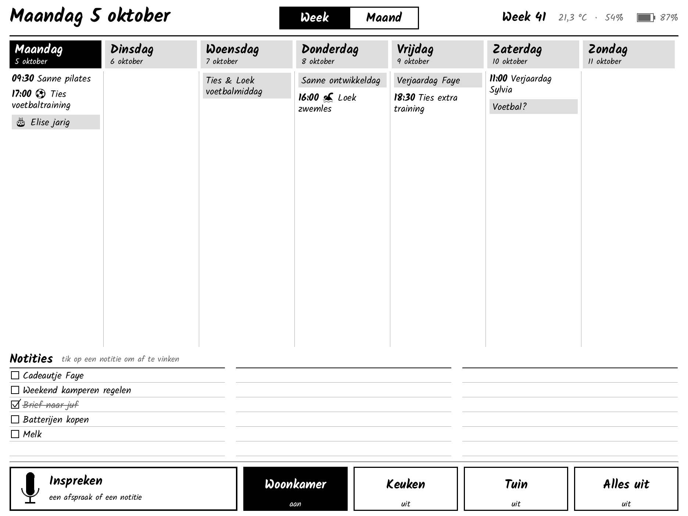
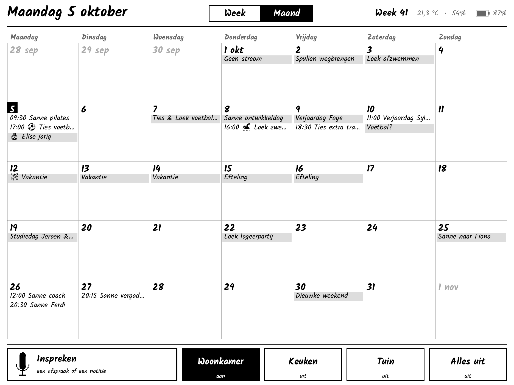
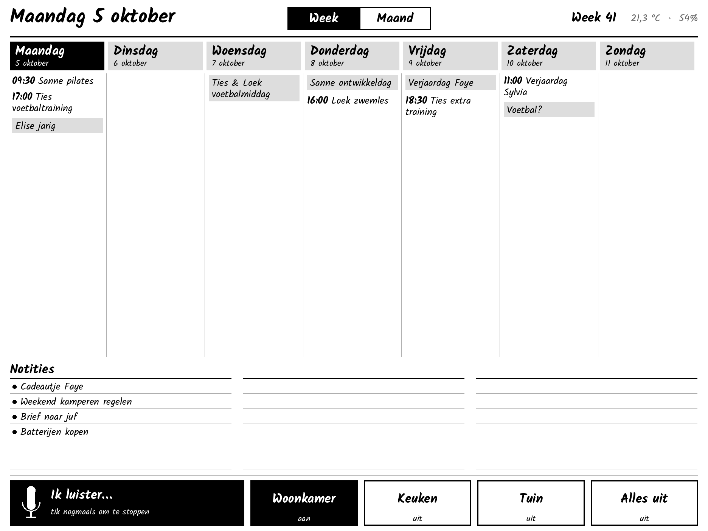
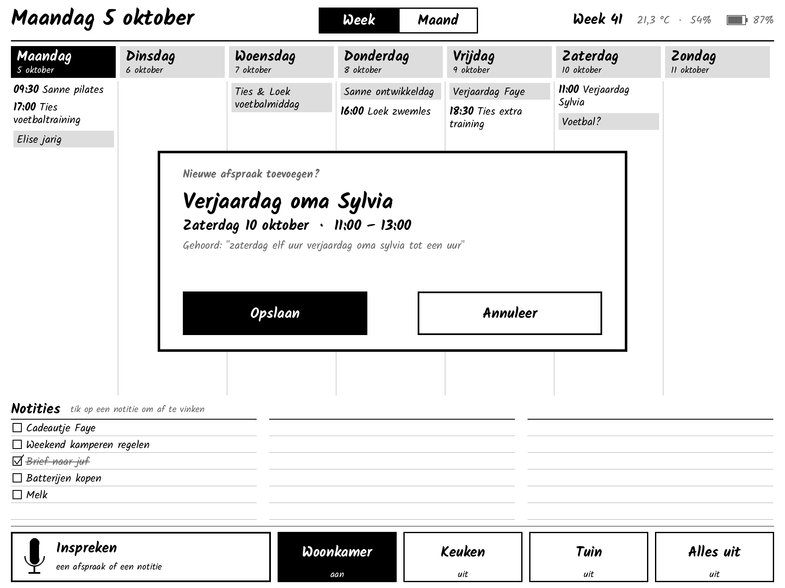
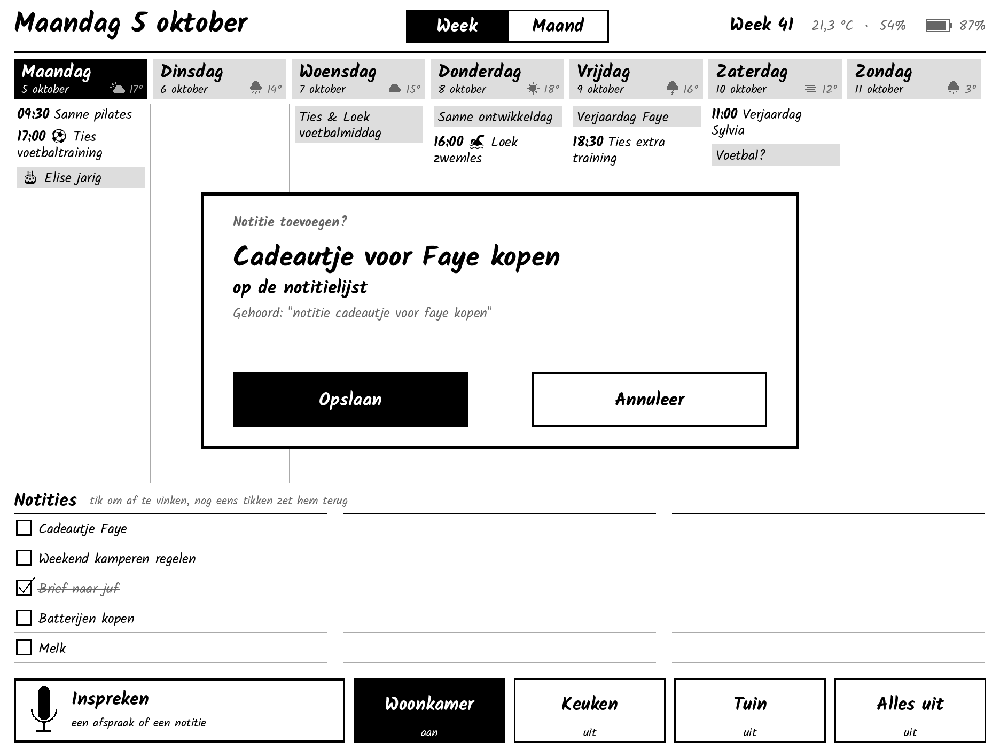
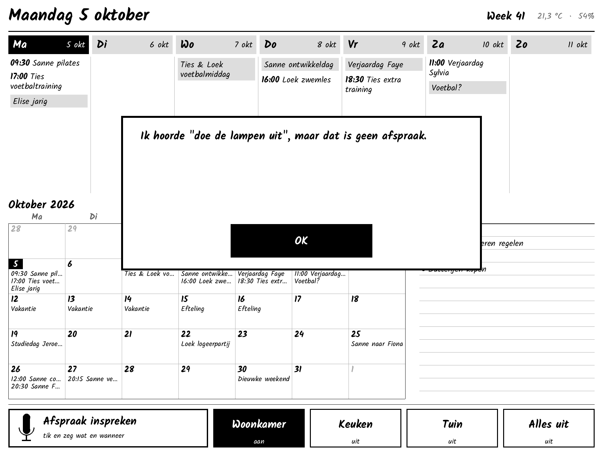

# Ink – gezinskalender op de reTerminal E1003

Vervangt het whiteboard op de koelkast door een Seeed reTerminal E1003
(10,3" e-paper, liggend), gekoppeld aan Home Assistant:

- **Twee schermen**, te wisselen met de tabs bovenin (of de linker witte knop):
  - **Week**: zeven dagen naast elkaar, met daaronder de notities (open taken uit een
    HA-takenlijst), net als op het whiteboard.
  - **Maand**: het hele maandrooster. Na 5 minuten springt het scherm vanzelf terug
    naar de week.
- **Handschrift-look**: lettertype Kalam.
- **Knoppen**: vier knoppen om lampen, scripts en dergelijke in HA aan of uit te zetten.
- **Inspreken** (alleen via de knop, geen wake word): tik op de knop en zeg bijvoorbeeld
  "zaterdag half drie verjaardag oma" (afspraak) of "notitie cadeautje voor Faye" (notitie).
  Het scherm laat zien wat het begrepen heeft; pas na **Opslaan** komt het in de kalender
  of op de takenlijst.
- **Notities afvinken**: tik op een notitie; die wordt meteen doorgestreept en in HA
  afgevinkt. Per ongeluk? In de HA-app staat hij onder "Voltooid" en kun je hem terugzetten.

| Week | Maand |
|---|---|
|  |  |

| Inspreken | Afspraak | Notitie | Melding |
|---|---|---|---|
|  |  |  |  |

*De previews worden gemaakt door de echte tekencode (`esphome/ink_kalender.h`),
zie [Preview en tests](#preview-en-tests).*

## Zo werkt het

```
 Local Calendar ─┐                         ┌─► week / maand / notities
 To-do-lijst ────┼─► blueprint (HA) ──────►│      (ESPHome-actie toon_agenda)
                 │         ▲               │
                 │         │ esphome.ink_spraak (tekst)
                 │   AI-taak: tekst ─► titel/datum/tijd ─► toon_voorstel
                 │         │
                 └─◄ calendar.create_event ◄── esphome.ink_opslaan (na "Opslaan")
```

- De spraakherkenning loopt via de normale **Assist-pijplijn** van HA (Whisper of HA Cloud).
- Een **AI-taak** (`ai_task.generate_data`) maakt van de zin een afspraak. Begrippen
  als "volgende week dinsdag" en "half drie" worden zo goed opgepakt.
- Het scherm ververst alleen als er iets verandert. Een volledige verversing
  (grijstinten, knippert ~1 s) volgt bij nieuwe agenda-data en om middernacht. Knoppen
  en pop-ups gebruiken de snelle DU-modus.

## Bestanden

| Pad | Wat |
|---|---|
| `esphome/ink-kalender.yaml` | ESPHome-config voor het scherm |
| `esphome/ink_kalender.h` | Layout, kalenderlogica en touchvlakken (C++, zie hieronder) |
| `esphome/secrets.example.yaml` | Voorbeeld voor `secrets.yaml` |
| `homeassistant/blueprints/ink_kalender.yaml` | Blueprint: agenda naar het scherm, spraak naar afspraak |
| `tools/preview/` | Tests en PNG-previews zonder hardware |

## Installatie

Nodig: Home Assistant met de **ESPHome Device Builder**-add-on (ESPHome **2026.7 of nieuwer**).

### 1. Home Assistant voorbereiden

1. **Kalender**: je hebt al een Local Calendar. Wil je per gezinslid de naam
   zien? Maak dan meerdere Local Calendars aan en zet in de blueprint
   "Kalendernaam voor de titel zetten" aan.
2. **Notities**: Instellingen → Apparaten en diensten → *Local To-do*, bijvoorbeeld
   een lijst "Notities". Notities toevoegen kan daarna via het scherm (inspreken),
   via de HA-app (*Takenlijsten*) of via een spraakassistent in HA ("zet melk op
   notities"). Ingesproken notities komen in de eerste lijst die je in de
   blueprint kiest.
3. **AI-taak**: voeg de integratie **OpenAI** toe (API-sleutel van
   platform.openai.com; bij dit gebruik een paar cent per maand). Kies in de
   integratie een *AI-taak* met model `gpt-4o-mini` of nieuwer en controleer dat
   er een `ai_task.…`-entiteit is. Alternatieven zijn Google Gemini, Anthropic en
   Ollama (lokaal, maar vraagt flinke hardware).
4. **Spraak-naar-tekst**: lichte hardware kan lokaal Whisper niet goed aan voor
   Nederlands. Kies een van deze twee:
   - **Home Assistant Cloud** (Nabu Casa, abonnement): het eenvoudigst, snel en goed in Nederlands.
   - **OpenAI Whisper** via de HACS-integratie *OpenAI Whisper Cloud*: dezelfde
     OpenAI-sleutel, betalen per gebruik. De officiële OpenAI-integratie doet
     (nog) geen spraak-naar-tekst.

   Maak daarna een assistent: Instellingen → Spraakassistenten → *Assistent
   toevoegen*, taal **Nederlands**, met die spraak-naar-tekst. Tekst-naar-spraak
   is niet nodig (het scherm heeft geen speaker).

### 2. Scherm flashen

1. Zet in de ESPHome Builder-add-on je secrets (wifi en API-sleutel),
   zie `esphome/secrets.example.yaml`.
2. Zet `ink-kalender.yaml` en `ink_kalender.h` samen in `/config/esphome/`. Dat kan
   via de *File editor*- of *Studio Code Server*-add-on.
3. Pas bovenin `ink-kalender.yaml` de `substitutions` aan: de vier knoppen
   (`knopN_naam` en `knopN_entiteit`; een lege naam verbergt de knop) en eventueel
   `lettertype` (elk Google Font; zie `docs/fonts-vergelijking.png`).
4. Installeer. De eerste keer moet dat via USB-C vanaf een computer (Chrome of Edge):
   *Install → Manual download*, daarna flashen via <https://web.esphome.io>.
   Daarna gaan updates draadloos.

### 3. Koppelen

1. HA ziet het nieuwe ESPHome-apparaat; voeg het toe.
2. Ga naar **ESPHome → Ink kalender → Configureren** en zet
   **"Allow the device to perform Home Assistant actions"** aan. Zonder deze
   instelling werken de knoppen en het inspreken niet.
3. Kies bij het apparaat onder *Configuratie → Assistent* de Nederlandse assistent uit stap 1.

### 4. Blueprint

De repo is privé, dus zet je het bestand met de hand in HA: maak met de
*File editor*-add-on `/config/blueprints/automation/ink/ink_kalender.yaml` aan, plak
de inhoud van `homeassistant/blueprints/ink_kalender.yaml` en kies bij
Automatiseringen → Blueprints *Blueprints opnieuw laden* (of herstart HA).

Maak daarna een automatisering van de blueprint. Je kiest daarin de kalenders,
de kalender voor nieuwe afspraken, eventuele takenlijsten en de AI-taak.

## Bediening

| | |
|---|---|
| **Week / Maand** (tabs bovenin) | Wisselen van scherm |
| **Inspreken** (of de groene knop) | Tik, spreek, wacht. Tik nog een keer om te stoppen. |
| **Opslaan / Annuleer** | Na het inspreken. Zonder keuze sluit het venster na 3 minuten. |
| **Notitie aantikken** | Afvinken |
| **HA-knoppen** | Zetten de entiteit aan of uit; zwart betekent aan. |
| Rechter witte knop | Scherm volledig verversen |
| Linker witte knop | Wisselen tussen week en maand |

## Problemen oplossen

**Touch klopt niet (je tikt op de ene knop en een andere reageert).**
De richting van de touchlaag ten opzichte van het scherm heb ik afgeleid uit het
voorbeeldproject van Seeed. Op echte hardware is dat nog niet gecontroleerd.
Bekijk de logs (ESPHome → *Logs*): bij elke tik staat er `Aanraking op x=…, y=…`.
Linksboven hoort ongeveer (0, 0) te geven en rechtsonder ongeveer (1872, 1404).

| Situatie | `touch_mirror_x` | `touch_mirror_y` |
|---|---|---|
| x klopt, y is omgekeerd | ongewijzigd | omdraaien |
| y klopt, x is omgekeerd | omdraaien | ongewijzigd |
| Beide omgekeerd | omdraaien | omdraaien |

Hangt het scherm andersom (beeld op z'n kop)? Zet `rotatie: "180"` en beide
`touch_mirror`'s op `"true"`.

**Inspreken doet niets.** Controleer stap 3.2 en 3.3 en kijk of de automatisering
draait (Instellingen → Automatiseringen → *Ink kalender* → Traces).

**Verkeerd verstaan, of herkend als een andere taal.** Controleer eerst dat de
spraak-naar-tekst van de assistent op **Nederlands** staat (niet Fries of automatisch).
Is de microfoon te zacht, zet dan `mic_versterking` bovenin `ink-kalender.yaml`
hoger (bijvoorbeeld 8). Worden woorden juist verhaspeld bij luid praten, dan
lager. Wat HA verstaan heeft, zie je via Instellingen → Spraakassistenten →
*Ink* → ⋮ → *Debug*.

**"Geen verbinding" bovenaan.** Het scherm heeft vijf minuten geen contact met HA gehad.

## Geluidjes

Zachte korte melodietjes in plaats van een piep:

| Wanneer | Geluid |
|---|---|
| Tik op een knop | kort zacht tikje |
| Inspreken begint | twee tonen omhoog |
| Je bent gehoord | twee tonen omlaag |
| Opgeslagen | drie tonen omhoog (akkoordje) |
| Melding / iets ging mis | twee lage tonen omlaag |

In HA staan bij het apparaat een schakelaar **Geluid** en een schuif **Volume**
(0–50%, standaard 15%; bij het verschuiven hoor je hoe hard het wordt). 's Avonds
en 's nachts (21:00–7:00) is het stil. De tijden en de melodietjes zelf staan
bovenin `ink-kalender.yaml` (RTTTL-formaat, dat is hetzelfde formaat als oude
Nokia-ringtones).

## Accu

In Home Assistant komen twee sensoren bij het apparaat: **Accu** (%) en
**Accuspanning** (V, onder *Diagnose*). Op het scherm staat rechtsboven een
accu-icoontje met het percentage. Onder de 15% wordt dat vet, met "opladen!" ervoor.

- Het percentage komt uit de ontlaadcurve van Seeed (3,27 V = 0%, 4,15 V = 100%).
- Het scherm ververst alleen bij een stap van 10%, zodat het niet steeds knippert.
- Of de USB-kabel erin zit, kan de software niet zien; dat geeft alleen het rode
  lampje aan. Met USB eraan staat de accu rond de 100%.

### Hoe lang gaat de accu mee?

Het ligt helemaal aan of het apparaat wakker blijft of slaapt:

| Situatie | Stroom | Accuduur (3000 mAh) |
|---|---|---|
| Ink met **spaarstand uit**: altijd aan (wifi, touch, knoppen, inspreken) | ~185 mA | ca. 12–16 uur |
| Ink met **spaarstand aan** (standaard, zie hieronder) | gemiddeld ~5–8 mA | **ca. 2–4 weken** (schatting) |
| Ink met spaarstand aan, **alleen wekken met de knoppen** (`touch_wekt: "false"`) | gemiddeld ~2–3 mA | ca. 5–7 weken (schatting) |
| ESPHome met deep sleep, elke 4 uur verversen (standaard) | 4–5 mA in slaap | 20–30 dagen |
| Idem, met geoptimaliseerde slaapstand | < 0,1 mA in slaap | 3–6 maanden |
| Seeed-opgave: 1× per dag verversen | – | tot 6 maanden |

De stroomwaarden zijn metingen van het community-project
[ar0v3r/reTerminal-E1003-ESPHome](https://github.com/ar0v3r/reTerminal-E1003-ESPHome)
op dezelfde hardware. Je kunt het zelf controleren door de USB-kabel eruit te halen
en de geschiedenis van de sensor *Accu* in HA te bekijken.

## Spaarstand

Staat standaard **aan** (schakelaar **Spaarstand** bij het apparaat in HA).

| Wat | Wat je ziet |
|---|---|
| Een minuut niets gedaan | Onderin verschijnt **"Slaapstand – tik twee keer op het scherm om te wekken"**; de agenda blijft gewoon zichtbaar (e-paper heeft geen stroom nodig om een beeld te houden). |
| Dubbeltik op het scherm of druk op een knop | Onderin **"Even wakker worden…"**; na een paar seconden ververst het scherm en werkt alles. De dubbeltik waarmee je wekt telt niet als tik op een knop. Een enkele tik wekt hem niet. |
| Groene knop terwijl hij slaapt | Wordt wakker en begint daarna meteen met luisteren. |
| Elk half uur | Wordt stil wakker, haalt de agenda op en ververst **alleen als er iets veranderd is**. Daarna weer slapen. |
| 's Nachts (23:00–6:00) | Slaapt door tot 6:00. |
| Inspreken of een open venster | Gaat pas slapen als je klaar bent. |

In te stellen bovenin `ink-kalender.yaml`: `wakker_na_gebruik`, `wekker_elke`,
`nacht_van`/`nacht_tot` en `touch_wekt`.

**Geschatte accuduur met spaarstand: 2–4 weken.** Dat is een schatting op basis van
de metingen hierboven: ±35 stille rondes per dag van ~15 s, ~10 keer per dag
gewekt en een minuut gebruikt, en een touch-chip die aan blijft om te kunnen wekken.
Met `touch_wekt: "false"` (alleen wekken met de knoppen) eerder 5–7 weken. Bekijk de
echte waarde na een paar dagen in de geschiedenis van *Accu*.

**Goed om te weten:**
- **Verbinding:** tijdens het slapen is het scherm offline. HA onthoudt de laatste
  waarden (accu, temperatuur); de automatisering stuurt de agenda gewoon bij de
  volgende ronde.
- **Firmware-update:** maak het scherm eerst wakker met een tik en zet binnen een
  minuut in HA de **Spaarstand** uit. Na de update zet je hem weer aan.
- **Touch-wekken:** werkt zoals in Seeeds eigen SenseCraft-firmware: vlak voor het
  slapen gaat de touch-chip in "gebarenmodus" en wekt hij het scherm via een
  aparte wekpin (ext0). In die modus herkent de chip alleen een **dubbeltik**; een
  enkele tik wekt hem niet (getest op het apparaat). Wordt het scherm steeds meteen
  weer wakker, dan schakelt Ink touch-wekken na drie keer zelf uit tot je een keer
  met een knop wekt. Werkt het helemaal niet, zet dan `touch_wekt: "false"`; dan
  gaat bovendien alles tijdens de slaap helemaal uit (zuiniger).
- **Aan de stroom:** hangt hij aan USB-C, zet dan de spaarstand gewoon uit voor een
  scherm dat altijd direct reageert.

## Waarom C++?

De E1003 heeft geen Linux of terminal: er zit een ESP32-S3-microcontroller in. Het
"reTerminal" uit de naam slaat op Seeeds Raspberry Pi-apparaten, maar de E-serie is
een andere familie. Er zijn drie manieren om hem te programmeren:

- **ESPHome** (gekozen). Alles wat HA-koppeling, knoppen, microfoon en touch is,
  staat in YAML. Alleen het tekenen gebeurt in ESPHome altijd met kleine stukjes
  C++ (`lambda`). Die staan gebundeld in `ink_kalender.h`, zodat de YAML leesbaar
  blijft en de layout op de pc te testen en te previewen is. Je hoeft er niets aan
  te doen; aanpassen kan via `substitutions`.
- **ESPHome met LVGL**: widgets in YAML. Dat werkt goed voor vaste knoppen, maar
  slecht voor een kalender met een wisselend aantal afspraken per dag.
- **SenseCraft HMI**: de drag-and-drop-firmware van Seeed. Snel, maar zonder
  inspreken en met beperkte koppeling naar HA.

## Preview en tests

Zonder hardware de layout bekijken en de logica testen (vraagt `g++` en Python met Pillow):

```bash
pip install pillow
python3 tools/preview/render.py
```

Dit compileert `ink_kalender.h` tegen een nagebootste ESPHome-display, draait de
tests in `tools/preview/tests.cpp` en schrijft `docs/preview-*.png`. Voorbeelddata
staat in `tools/preview/preview.cpp`.

## Status

Getest zonder hardware:
- `esphome config` slaagt met ESPHome 2026.9.1.
- `ink_kalender.h` compileert tegen de echte ESPHome-display-headers.
- De datum- en parsetests slagen.
- De blueprint-templates zijn doorgerekend met voorbeelddata.

Nog niet getest:
- een volledige firmware-build en de werking op het apparaat zelf;
- de touch-oriëntatie en de microfoongevoeligheid (zie *Problemen oplossen*).

## Ideeën voor later

- Wake word ("Hey Jarvis") via `micro_wake_word`. Dat kan op de ESP32-S3, maar
  het scherm moet dan aan de stroom hangen.
- Spraakopdrachten voor HA zelf ("doe de lampen uit"), naast afspraken.
- Kleur of initialen per gezinslid.
- Weersverwachting in de kop.
